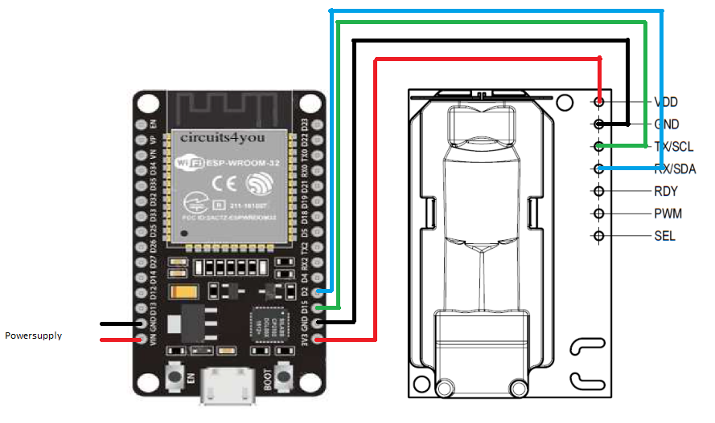

# IoTDevice setup

## Hardware

* ESP 32 WROOM
* Sensirion SCD30

Connect the sensor to the board:

## Firmware

Before you flash the program you need to change:
* SSID : set this to your ssid
* PASSWORD : set this to the password for your ssid
* SERVER : correct the IP-adress and path of the server

Use the Arduino IDE to flash the program iotdevice_v2.ino to the board.

## Boot sequence

The device will take you to a setup wizard, so you need the serial monitor for this.

1. Input the altitude your sensor will be operating on ( meter above sealevel )
2. Calibrate the sensor in open air
3. Input the temperature offset

Once the setup is complete you can disconnect the monitor.